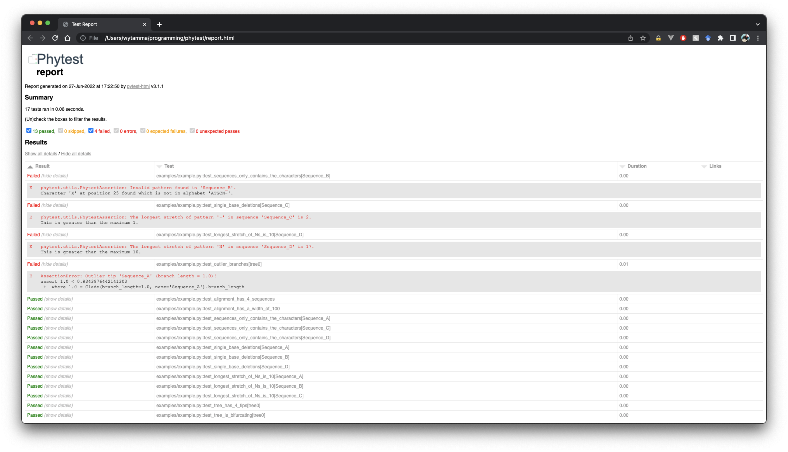

==============
phytest
==============

.. start-badges

|pipeline badge| |coverage badge| |docs badge| |black badge| |pre-commit badge| |ice-virus-example badge|

.. |pipeline badge| image:: https://github.com/smutch/phytest/workflows/pipeline/badge.svg
    :target: https://github.com/smutch/phytest/actions

.. |docs badge| image:: https://github.com/smutch/phytest/workflows/docs/badge.svg
    :target: https://smutch.github.io/phytest/

.. |black badge| image:: https://img.shields.io/badge/code%20style-black-000000.svg
    :target: https://github.com/psf/black

.. |coverage badge| image:: https://img.shields.io/endpoint?url=https://gist.githubusercontent.com/smutch/e8160655e03d9015b1e93b97ed611f4f/raw/coverage-badge.json
    :target: https://smutch.github.io/phytest/coverage/

.. |pre-commit badge| image:: https://results.pre-commit.ci/badge/github/phytest-devs/phytest/main.svg
    :target: https://results.pre-commit.ci/latest/github/phytest-devs/phytest/main

.. |ice-virus-example badge| image:: https://github.com/smutch/phytest/workflows/ice-virus-example/badge.svg
    :target: https://github.com/smutch/phytest/actions/workflows/ice_virus_example.yml

.. end-badges

Quality control for phylogenetic pipelines using pytest

.. start-quickstart

Installation
============
Install phytest using pip:

.. code-block:: bash

    pip install git+https://github.com/smutch/phytest.git

.. note ::

    Soon installation will be possible using PyPI.

Usage
============

Phytest will run user defined tests against an alignment and tree file. Here we will create example data files to run our tests on.

Create an alignment fasta file :code:`example.fasta`

.. code-block:: text

    >A
    ATGAGATCCCCGATAGCGAGCTAGCGATCGCAGCGACTCAGCAGCTACAGCGCAGAGGAGAGAGAGGCCCCTATTTACTAGAGCTCCAGATATAGNNTAG
    >B
    ATGAGATCCCCGATAGCGAGCTAGXGATCGCAGCGACTCAGCAGCTACAGCGCAGAGGAGAGAGAGGCCCCTATTTACTAGAGCTCCAGATATAGNNTAG
    >C
    ATGAGA--CCCGATAGCGAGCTAGCGATCGCAGCGACTCAGCAGCTACAGCGCAGAGGAGAGAGAGGCCCCTATTTACTAGAGCTCCAGATATAGNNTAG
    >D
    ATGAGATCCCCGATAGCGAGCTAGCGATCGCAGCGACTCAGCAGCTACAGCGCAGAGGAGAGAGAGGCCCCTATTTACTAGAGCTCCAGATATAGNNTAG
    >E
    ATGAGATCCCCGATAGCGAGCTAGCGATNNNNNNNNNNNNNNNNNTACAGCGCAGAGGAGAGAGAGGCCCCTATTTACTAGAGCTCCAGATATAGNNTAG

Create a tree newick file :code:`example.tree`

.. code-block:: text

    (A:0.1,B:0.2,(C:0.3,D:0.4):0.5);

Writing a test file
########################

We want to enforce the follow constraints on our data:
    1. The alignment has 4 sequences
    2. The sequences have a length of 100
    3. The sequences only contains the characters A, T, G, C, N and -
    4. The sequences are allowed to only contain single base deletions
    5. The longest stretch of Ns is 10
    6. The tree has 4 tips
    7. The tree is bifurcating
    8. There are no outlier branches in the tree

We can write these tests in a python files :code:`example.py`

.. include:: examples/example.py
   :code: python

We can then run these test on our data with :code:`phytest`:

.. code-block:: bash

    phytest examples/example.py -a examples/data/example.fasta -t examples/data/example.tree

Generate a report by adding :code:`--report`.

This report can be customised in future (see the `pytest-html user guide <https://pytest-html.readthedocs.io/en/latest/user_guide.html>`_).

From the output we can see several tests failed:

.. code-block:: bash

    FAILED examples/example.py::test_sequences_only_contains_the_characters[B] - AssertionError: Invalid pattern found in 'B'!
    FAILED examples/example.py::test_single_base_deletions[C] - AssertionError: Longest stretch of '-' in 'C' > 1!
    FAILED examples/example.py::test_longest_stretch_of_Ns_is_10[D] - AssertionError: Longest stretch of 'N' in 'D' > 10!
    FAILED examples/example.py::test_no_outlier_branches - AssertionError: Outlier tip 'A' (branch length = 1.0)!

    Results (0.07s):
        30 passed
        4 failed
            - examples/example.py:20 test_sequences_only_contains_the_characters[B]
            - examples/example.py:23 test_single_base_deletions[C]
            - examples/example.py:26 test_longest_stretch_of_Ns_is_10[D]
            - examples/example.py:35 test_no_outlier_branches

.. end-quickstart
